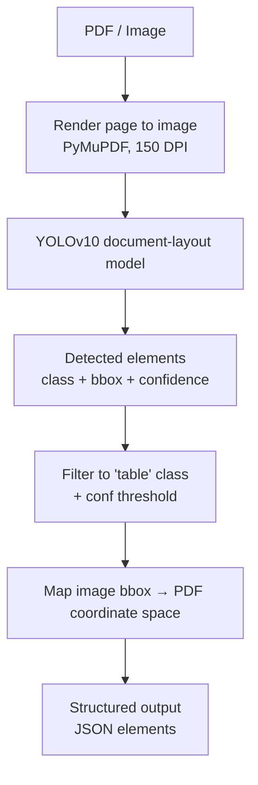

# 1. Document Intelligence Demo

## Pipeline

## What's from the public repo vs. what I changed

Be explicit about this split — don't let it sound like you trained the model.

| From the public repo (unmodified) | What I built on top |
|---|---|
| YOLOv10 architecture and weights (`yolov10x_best.pt`), fine-tuned on DocLayNet-style layout classes | The end-to-end orchestration script that ties detection to extraction |
| The DocLayNet class taxonomy (`table`, `text`, `title`, `figure`, etc.) | Filtering logic to keep only `table` detections above a confidence threshold |
| The base `model.predict()` inference call | PDF → image rendering at a fixed DPI using PyMuPDF, so the model sees a raster page instead of a PDF |
| | Coordinate transform from image pixel space back to PDF point space, so a detected box can be mapped onto the *original* PDF layout, not just the rendered image |
| | Wiring detected table regions into Tabula as an `area` parameter, so Tabula only looks inside the region YOLO found, instead of scanning the whole page |
| | The overall single-page and multi-page batch runner, logging, and result aggregation |

**One-line summary:** *"I didn't train this model — I took a pretrained YOLOv10 document-layout model and built the pipeline around it: PDF rendering, coordinate mapping, and a region-guided extraction step that feeds detected boxes into Tabula."*

## Why document layout detection matters

- Most real-world documents (invoices, reports, financial filings, scientific papers) mix free text, tables, figures, and titles on the same page. Naive text/PDF parsers treat all of this as one text stream, which destroys table structure.
- Layout detection gives you a *semantic map* of the page before you try to read it — you know **where** a table is before you try to extract **what's** in it. That separation (detect → extract) is what makes the extraction step reliable instead of a heuristic guess over the whole page.
- It's also what makes downstream extraction tools (Tabula, OCR, LayoutLM-style models) tractable — giving them a tightly cropped region instead of a full page dramatically reduces false positives and misaligned columns.

## What YOLO is doing

- YOLO treats the rendered page as an image and performs single-shot object detection: it proposes bounding boxes and a class label + confidence score for each, in one forward pass.
- Here, the class of interest is `table`. For every detected box, we get `(x1, y1, x2, y2)`, a class name, and a confidence score.
- Because YOLO operates in *image pixel space*, and the downstream extraction tool (Tabula) operates in *PDF point space*, the pixel→PDF coordinate conversion (using the DPI scale factor) is the critical piece of glue code that makes the two halves of the pipeline agree on where the table actually is.

## Metrics to report (fill in from your own benchmark run)

Don't state numbers you haven't measured — say these are placeholders and show you know exactly how you'd get them.

| Metric | How to obtain it |
|---|---|
| Inference time | Wall-clock time per page for `model.predict()`, averaged over N pages, on your actual hardware (CPU vs GPU matters a lot — report both if relevant) |
| Model size | File size of `yolov10x_best.pt` on disk (`x` variant is the largest YOLOv10 size — worth noting a smaller variant like `yolov10s`/`m` trades accuracy for latency) |
| mAP@50 / mAP@50:95 | From the model card or your own validation run against a labeled table-detection set (e.g. DocLayNet val split) |
| Precision / Recall | Same validation run, at your chosen confidence threshold (0.30 here) — note that threshold choice is itself a precision/recall trade-off worth discussing |

## Failure cases to call out

- **Borderless / no-gridline tables**: `lattice=True` in Tabula assumes visible ruling lines. A YOLO-detected table with no visible borders will detect correctly but extract poorly or return `None` — worth mentioning `stream`-mode Tabula as a fallback.
- **Multi-page tables that split across a page break**: each page is processed independently, so a table continuing onto the next page is detected and extracted as two separate tables rather than one logical table — a real limitation to name explicitly, and a natural "what I'd improve next" answer.
