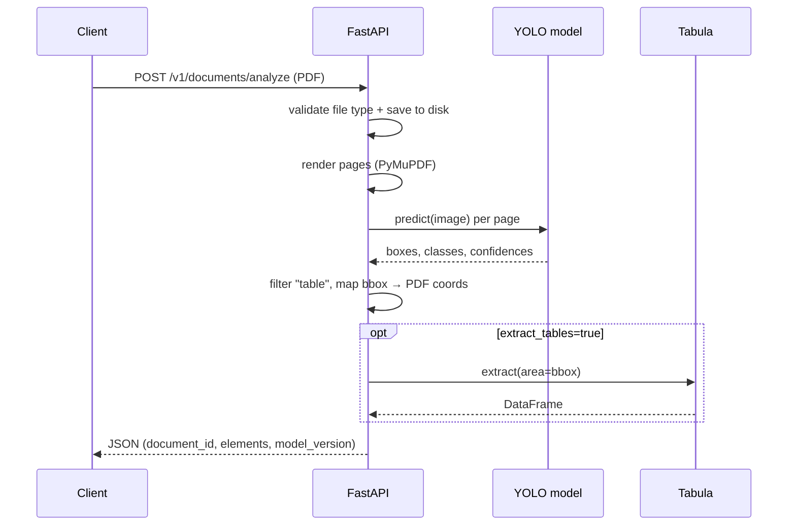

# 2. Turn the Model into a Production API

## Full API surface

```
GET    /healthz                                  → liveness check
GET    /model/info                               → model version, path, thresholds, load status
POST   /v1/documents/analyze                     → run detection (+ optional extraction) on an uploaded PDF
GET    /v1/documents/{document_id}/tables        → list cached tables for a document (summary only)
GET    /v1/documents/{document_id}/tables/{i}    → get one table's extracted rows, as JSON or CSV
DELETE /v1/documents/{document_id}               → delete a document and its cached data
```

| Method | Path | Purpose | Success | Failure modes |
|---|---|---|---|---|
| `GET` | `/healthz` | Liveness probe for an orchestrator (Kubernetes, ECS) | `200 {"status": "ok"}` | — |
| `GET` | `/model/info` | Inspect which model/config is actually loaded, without running inference | `200` with model version, path, confidence threshold, DPI, load status | — |
| `POST` | `/v1/documents/analyze` | Upload a PDF, run YOLO detection, optionally run Tabula extraction | `200` with `document_id`, `elements`, `model_version` | `400` bad file type or unreadable PDF |
| `GET` | `/v1/documents/{document_id}/tables` | List every cached table for a document — page, bbox, confidence, row/column counts, whether extraction succeeded | `200` with a `tables` array | `404` unknown `document_id` |
| `GET` | `/v1/documents/{document_id}/tables/{table_index}` | Fetch one table's actual rows (`?format=json` or `?format=csv`) | `200` with row data | `404` unknown document or table index, `422` table detected but extraction failed |
| `DELETE` | `/v1/documents/{document_id}` | Remove a document's file and cached data | `200 {"status": "deleted", ...}` | `404` unknown `document_id` |

This is deliberately more than the single endpoint in the original spec — a "list tables" + "get one table" split lets a client show a lightweight summary (row/column counts, confidence) before paying the cost of fetching full row data, and `DELETE` gives you a way to clean up storage instead of leaking uploaded PDFs and cached DataFrames indefinitely.

```json
POST /v1/documents/analyze

Input:
  multipart/form-data, field "file" = PDF

Response:
{
  "document_id": "b3e2f1...",
  "elements": [
    { "type": "table", "bbox": [72.0, 140.5, 520.3, 610.2], "confidence": 0.94 }
  ],
  "model_version": "yolov10-doc-v1"
}
```

## Request lifecycle



## Design points to walk through

**FastAPI**
Chosen for automatic request validation via Pydantic, auto-generated OpenAPI docs (`/docs`), and native `async` support — useful once inference or I/O-bound steps (disk, future object storage) need to run without blocking the event loop.

**Validation**
File extension is checked before any processing starts (`.pdf` only, today). Malformed or non-PDF uploads are rejected early with a `400`, before wasting a model call.

**Request/response schema**
The response is defined as a Pydantic model (`AnalyzeResponse`), not a hand-built dict — that's what gives you automatic schema validation, docs, and a stable contract that won't silently drift as the code changes.

**Model loaded once at startup, not per request**
The YOLO model is loaded lazily on first request and cached in a module-level singleton (`get_model()`), rather than reloading weights on every call. Reloading a model per request is a classic beginner mistake — it would dominate latency at any real throughput.

**Error handling**
- Bad file type → `400`
- Unreadable/corrupt PDF → `400` with the underlying parse error surfaced
- Requested table index not found → `404`
- Table detected but extraction failed (e.g. Tabula couldn't parse it) → `422`, distinct from "not found," so a client can tell "this doesn't exist" apart from "this exists but extraction failed."

**Health endpoint**
`GET /healthz` for liveness/readiness probes in an orchestrator (Kubernetes, ECS). A production version would also check that the model is actually loaded, not just that the process is up — `GET /model/info` already exposes a `model_loaded` flag that a readiness probe could build on.

**Model version in response**
Every response carries `"model_version": "yolov10-doc-v1"`. This matters operationally: if you retrain or swap the model, clients and logs can attribute results to the exact model version that produced them — critical for debugging regressions after a deploy.

**Synchronous vs. asynchronous processing**
The current endpoint is synchronous — the client waits for detection (and optionally extraction) to finish before getting a response. That's fine for single-page documents at low volume. For larger documents or higher throughput, the better pattern is:
1. `POST /v1/documents/analyze` accepts the file, enqueues a job, returns `202 Accepted` + a `document_id` immediately.
2. A separate worker pool pulls from the queue, runs inference, and writes results to a store.
3. `GET /v1/documents/{document_id}` polls for status/results (or push results via a webhook).

This is the natural bridge into the deployment/queue discussion in section 4.