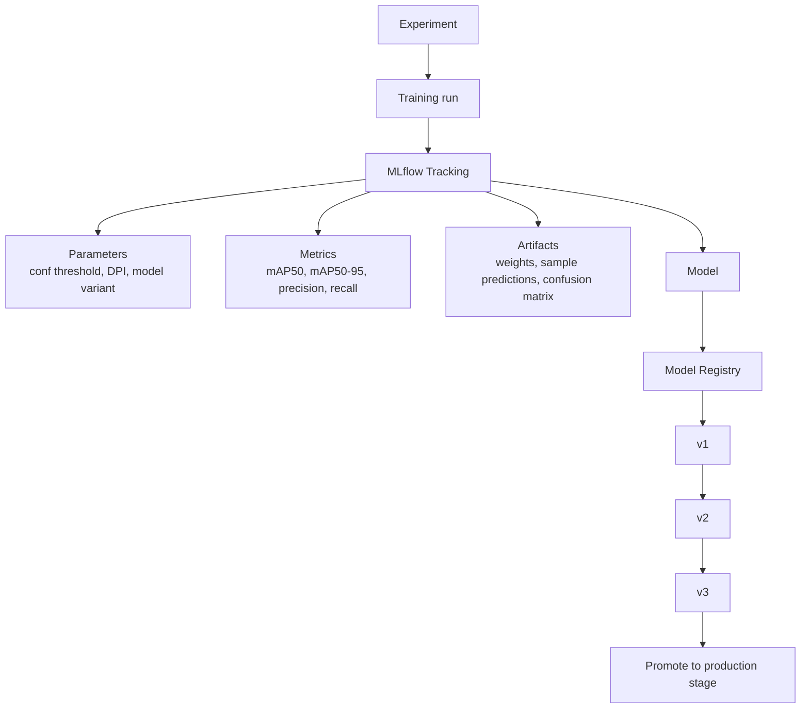

# 3. MLflow + Model Versioning + Metrics

## Tracking flow

## Two categories of metrics — don't conflate them

### Model (offline) metrics
Measured once, against a fixed validation set, before deployment.

| Metric | What it tells you |
|---|---|
| mAP@50 | Detection quality at a lenient IoU threshold (0.5) |
| mAP@50:95 | Detection quality averaged across strict IoU thresholds — a harsher, more realistic number |
| Precision | Of the boxes the model called "table," how many actually were |
| Recall | Of the actual tables on the page, how many the model found |

### Production (online) metrics
Measured continuously, in the running system, after deployment.

| Metric | Why it matters operationally |
|---|---|
| Inference latency (p50/p95/p99) | Tail latency is what users feel, not the average |
| Throughput (docs/sec) | Determines how many workers you need for a given load |
| GPU memory usage | Determines how many model instances fit per GPU |
| CPU / host memory | Matters for the non-GPU parts of the pipeline (PDF rendering, Tabula, JVM overhead) |
| Model size on disk | Affects cold-start time, container image size, deployment speed |

## How this maps onto versioning

- Every training run logs params + metrics + the resulting weights file to MLflow Tracking.
- The **Model Registry** turns a tracked run into a named, versioned artifact (`v1`, `v2`, `v3`, ...), with stage transitions (`Staging` → `Production` → `Archived`).
- The FastAPI service's `model_version` field in every response should map directly to a registry version — so a production incident can be traced back to the exact run, its parameters, and its offline metrics in MLflow.
- This also enables safe rollback: if `v3` regresses in production metrics (latency, error rate) even though it looked better offline, you can repoint the service at `v2` without retraining anything.
