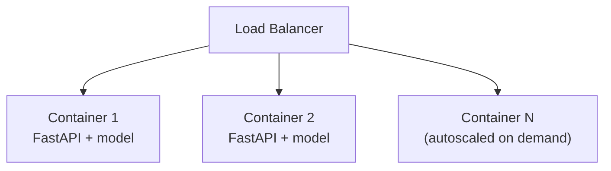
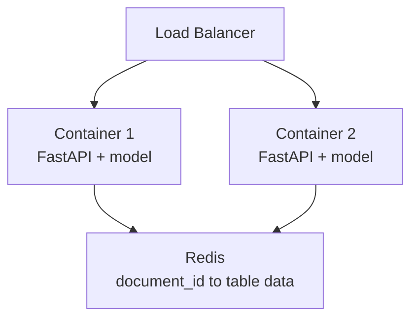

# 4. Deployment

## How this is actually deployed

This is a small internal service inside a larger web app — not a standalone high-volume product — so the deployment is intentionally simple: **containerize it, put it behind a load balancer, and let the load balancer autoscale instances.**

- **Docker**: the FastAPI app, the YOLO model weights, and dependencies (PyMuPDF, Tabula's JRE, etc.) are packaged into one image. Every instance is identical and stateless — no per-instance setup.
- **Load balancer**: distributes incoming requests across running containers, and handles health checks against `GET /healthz` to pull unhealthy instances out of rotation.
- **Autoscaling**: the load balancer / hosting platform adds or removes container instances based on load (CPU, request count, or concurrency, depending on the platform), instead of running a fixed number of instances all the time.

That's the whole picture — no separate queue, no dedicated GPU worker pool, no message broker. Each container serves requests directly and synchronously, which is appropriate at this scale.

**move the cache out of the process and into shared storage (Redis).**

- After `analyze`, table results (rows, bbox, confidence — as JSON, not the raw pandas object) are written to Redis under the `document_id`, instead of a local dict.
- `GET /v1/documents/{id}/tables` and `GET /v1/documents/{id}/tables/{index}` read from Redis, so it doesn't matter which container serves the follow-up request — any of them can look it up.
- A TTL on each key (e.g. 24h) means results expire automatically instead of accumulating forever, so Redis doesn't need separate cleanup logic.
- The uploaded PDF itself doesn't need to be shared — it's only read during the single `analyze` request, on whichever container handled it, and can be deleted from local disk right after processing.

This keeps every container fully stateless and interchangeable, which is what actually makes "just add more containers behind a load balancer" a valid scaling strategy — without it, autoscaling silently produces intermittent 404s as soon as there's more than one instance.

Worth having as a one-line answer if asked, without over-engineering the actual demo:

> "If load grew significantly — high volume, larger documents, or a need to decouple slow processing from the request path — I'd move to an async pattern: accept the upload, enqueue the job, and let a separate worker pool process it. But for this service's actual scale, Docker + load balancer autoscaling is simpler, cheaper, and easier to operate."